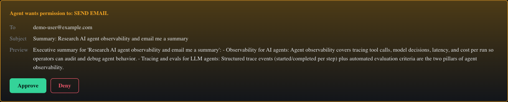
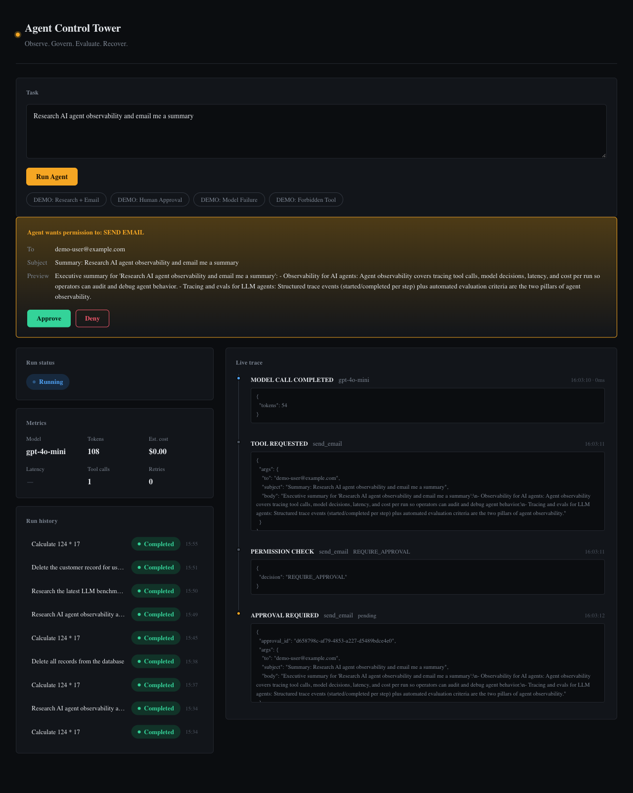
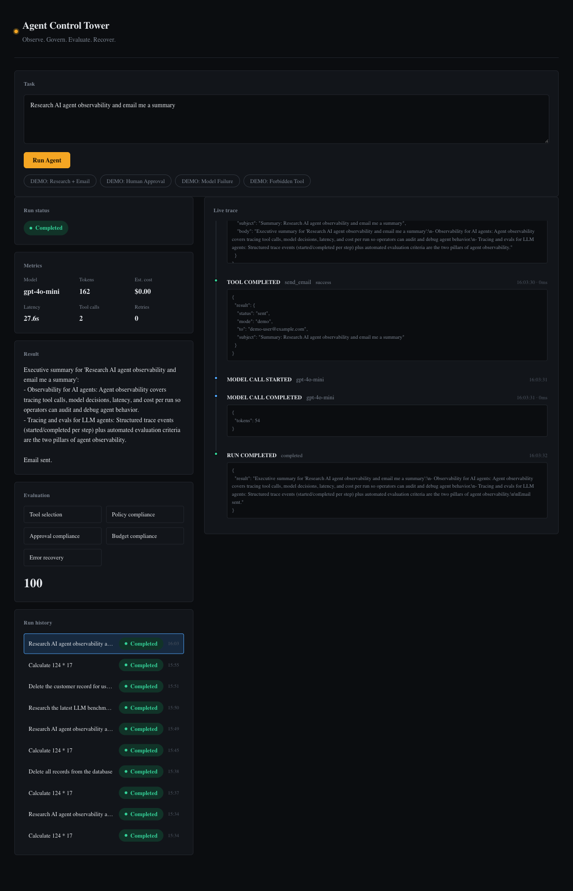

# CampaignForge

CampaignForge is a multi-agent campaign-production workflow designed for [TrueForge](https://trueforge.dev). It turns a guided campaign brief into approved creative concepts, OpenAI-generated static images, platform-specific social drafts, and—only with per-post human approval—live publishing through LinkedIn, Meta, and TikTok.

Generated PNGs are exposed through CampaignForge's local asset endpoint and returned to the agent as Markdown, so they render inline in TrueForge instead of becoming sandbox downloads. For production, use durable object storage and an HTTPS asset URL.

The project intentionally separates:

- **TrueForge skills** (`skills/`): repeatable agent procedures and review rules.
- **CampaignForge MCP** (`src/`): media, research, validation, draft, and publishing tools.
- **TrueForge UI**: the operator-facing agent configuration, chat, approvals, and trace view.

## What to prioritize

1. Make the concept approval gate feel excellent. It prevents wasted image-generation cost and gives the demo a clear human decision.
2. Keep all copy and static-image assets tied to one selected concept and shared campaign contract.
3. Treat platform publishing as a separate, per-post effect—not an automatic next step.
4. Validate every connector with test accounts before a live demo. Four networks are the project’s largest external risk.

## Local development

```bash
cp .env.example .env
npm install
npm run dev
```

The MCP endpoint is `http://127.0.0.1:8788/mcp`; health is available at `/health`.

Run verification with:

```bash
npm run check
npm test
```

See [the TrueForge setup guide](docs/trueforge-setup.md) for connector and agent configuration.

## Safety model

`PUBLISHING_ENABLED` defaults to `false`. Even when it is enabled, the `publish_post` MCP tool is marked as destructive and must be configured as approval-required in TrueForge. The agent instructions also require a fresh user confirmation for each exact post payload. CampaignForge currently generates static images only; TikTok live publishing remains unavailable until a photo-post adapter is added.

Never store API keys in skills, prompts, or campaign briefs. Configure all keys only in the MCP service environment or through TrueForge connector settings.

## TrueForge demo screenshots

The screenshots below show the harness behavior used by CampaignForge: a human approval pause, live agent trace, and a completed run with evaluation metrics.

### Human approval gate



### Live trace and tool call



### Completed run and evaluation



For the architecture view, open [docs/trueforge-architecture.html](docs/trueforge-architecture.html) in a browser.
